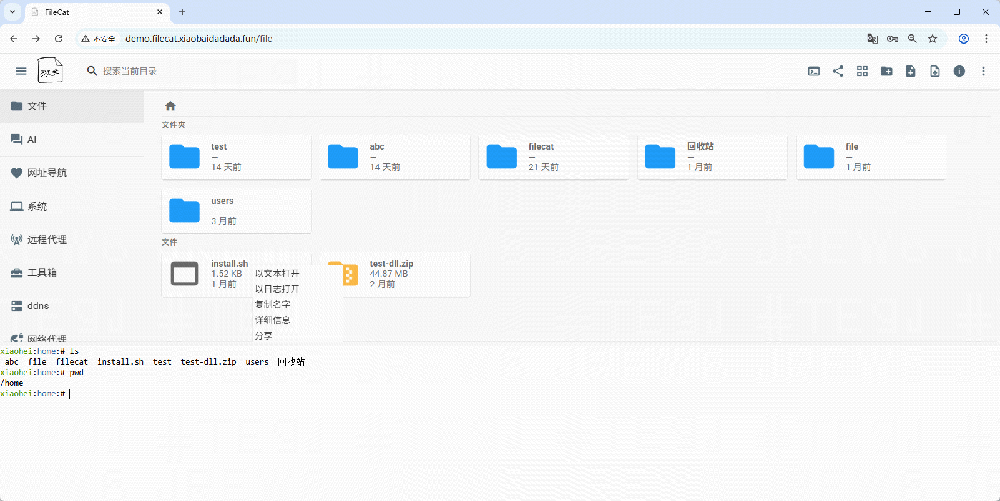
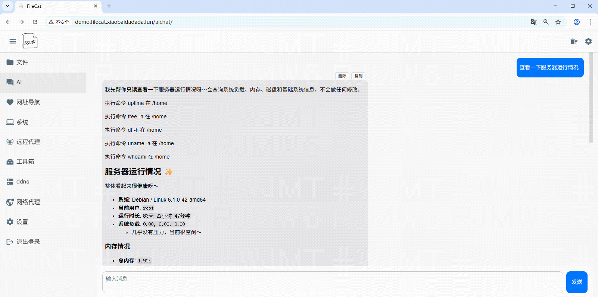
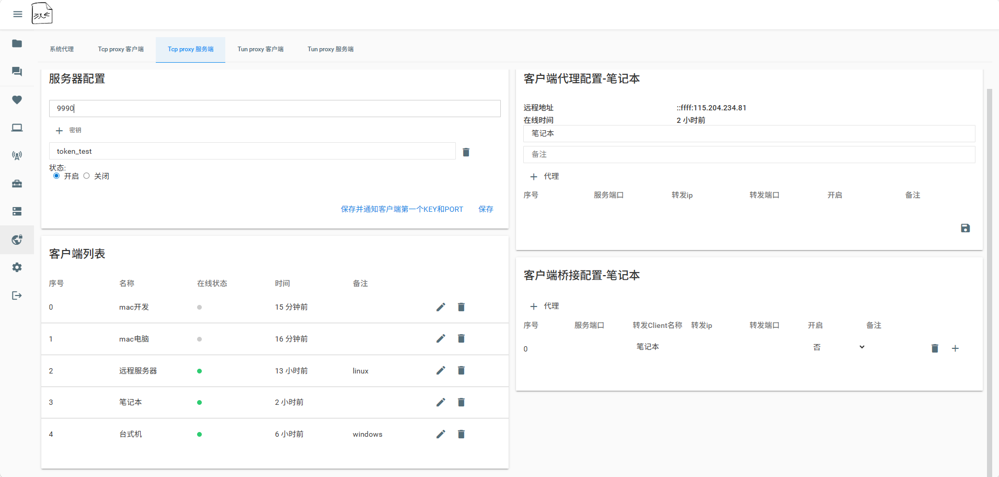
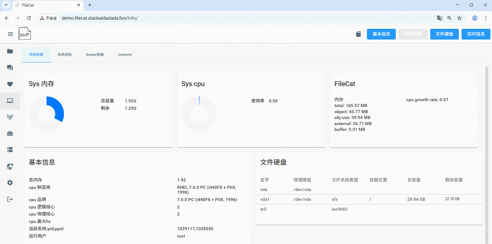

<p align="center">
  
</p>

<h1 align="center">FileCat</h1>

<p align="center">
  <i>A self-hosted Web file server and lightweight server management tool</i>
</p>

<p align="center">
  <a href="https://www.npmjs.com/package/filecat">
    
  </a>
  <a href="https://www.npmjs.com/package/filecat">
    
  </a>
  <a href="https://github.com/xiaobaidadada/filecat">
    
  </a>
  <a href="https://ghcr.io/xiaobaidadada/filecat">
    
  </a>
  <a href="https://github.com/xiaobaidadada/filecat/blob/main/LICENSE">
    
  </a>
</p>

<p align="center">
  <a href="#features">Features</a> •
  <a href="#screenshots">Screenshots</a> •
  <a href="#installation">Installation</a> •
  <a href="#quick-start">Quick Start</a>
</p>

<p align="center">
  <a href="./doc/CH_README.md">中文</a>
</p>

---

FileCat is a self-hosted Web file server and a **lightweight server management tool**. Once deployed, you can manage files on your server anytime and anywhere through a browser, while also enjoying a wide range of server management and operations features.

FileCat uses the UI of [filebrowser](https://github.com/filebrowser/filebrowser).

> **Core philosophy**: Centered around file management, FileCat integrates AI Agent, remote desktop, intranet tunneling, system monitoring, and other capabilities to make server management simpler.

---

## Features

| Category                     | Features                                                                                                                                                                                      |
| ---------------------------- | --------------------------------------------------------------------------------------------------------------------------------------------------------------------------------------------- |
| File Management              | Browse, upload, download, edit, and preview files online (images, videos, Markdown, drawings, etc.)                                                                                           |
| AI Agent                     | Integrates large language models to assist with server management and file processing (API configuration required). Supports QQ, WeCom, Feishu, DingTalk, and other third-party platform bots |
| Intranet Tunneling           | Expose services on an internal network to the public internet, or enable communication between multiple internal networks                                                                     |
| SSH Terminal                 | Built-in Web terminal for connecting to servers anytime through a browser                                                                                                                     |
| Windows Remote Desktop       | Directly operate remote Windows desktops (RDP) through a browser                                                                                                                              |
| System Information Dashboard | Real-time monitoring of CPU, memory, disk, network, and other system information                                                                                                              |
| CI/CD Workflow               | Create custom command pipelines for continuous integration and deployment                                                                                                                     |
| Large Log Viewer             | Instantly open text log files of any size and efficiently locate problems                                                                                                                     |
| Excalidraw Drawing           | Built-in whiteboard drawing tool                                                                                                                                                              |
| Multi-user Management        | Comprehensive permission management system                                                                                                                                                    |
| Shareable Links              | Generate file sharing links for convenient downloads                                                                                                                                          |
| Multiple Path Mounts         | Support mounting multiple filesystem paths                                                                                                                                                    |

---

## Screenshots

<table>
  <tr>
    <td align="center"><b>File List</b></td>
    <td align="center"><b>AI Agent</b></td>
  </tr>
  <tr>
    <td></td>
    <td></td>
  </tr>
  <tr>
    <td align="center"><b>Intranet Tunneling</b></td>
    <td align="center"><b>System Information Dashboard</b></td>
  </tr>
  <tr>
    <td></td>
    <td></td>
  </tr>
</table>

---

## Demo

Online demo: **[http://demo.filecat.xiaobaidadada.fun/](http://demo.filecat.xiaobaidadada.fun/)**

Username and password: `demo`/`demo` or `test`/`test`

> The demo server is sponsored by [Yecaoyun](https://my.yecaoyun.com/aff.php?aff=7185).

---

## Installation

> Minor bug fixes and feature updates are released and synchronized on npm in real time.

### 1. NPM Installation (Recommended)

```bash
npm install -g filecat
```

On Linux, after installation, you can use `pm2` to keep the process running, or register FileCat as a systemd service for process management.

### 2. One-click Linux Installation Script

```bash
curl -o install.sh https://filecat.xiaobaidadada.fun/files/linux-install.sh && bash install.sh
```

The script automatically downloads the binary package and performs the installation. Simply follow the prompts to enter the required parameters.

### 3. Binary Package

Download the latest version for your operating system from [Releases](https://github.com/xiaobaidadada/filecat/releases).

### 4. Docker

```bash
docker run -d --name filecat --restart=always --net=host \
  -v /home:/home \
  ghcr.io/xiaobaidadada/filecat:latest \
  --port 5567 --base_folder /home
```

### 5. Build from Source

```bash
git clone https://github.com/xiaobaidadada/filecat.git
cd filecat
npm install
npm run dev        # Development mode
# or
npm run build && node build/main.js  # Production mode
```

---

## Quick Start

**Method 1**: After installing via NPM:

```bash
filecat --port 5567
```

**Method 2**: After extracting the binary package, run the `filecat-run.sh` script (Linux/Mac) or `filecat-run.cmd` script (Windows) included in the directory.

**Default username/password**: `admin` / `admin`

> For more options, run `filecat --help`.

> **Permission Notice**: By default, FileCat can only access the installation directory after installation. Configure the directories and execution permissions accessible to each user in the settings.

---

## Upgrade Guide

1. **Regular Upgrade**: Upgrade according to your installation method:

   * NPM: `npm -g i filecat`
   * Docker: Pull the latest image again
   * Binary: Download and replace the latest package
2. **Automatic Upgrade** (v5.33.0+): Run the `filecat-upgrade` command to automatically upgrade according to the installation environment. Docker and binary installations also support custom download URL parameters.

---

## Community

Join the QQ group **824838674** for discussion, feedback, and support.
