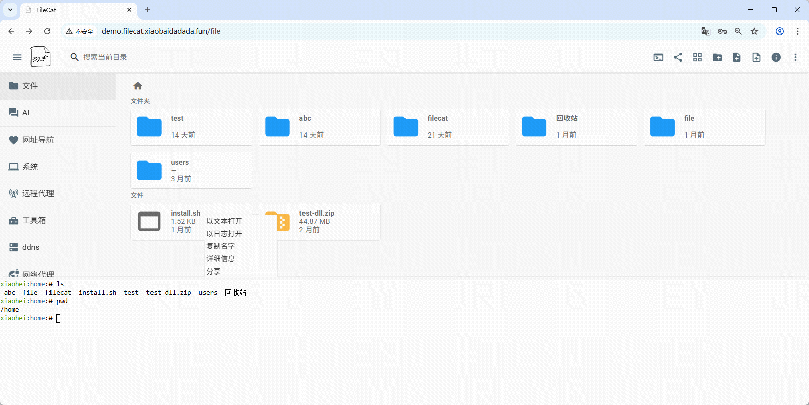
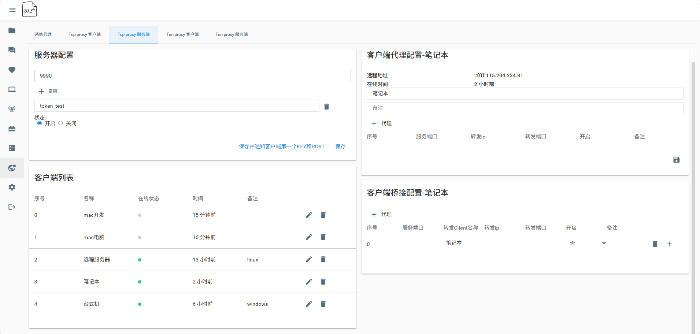
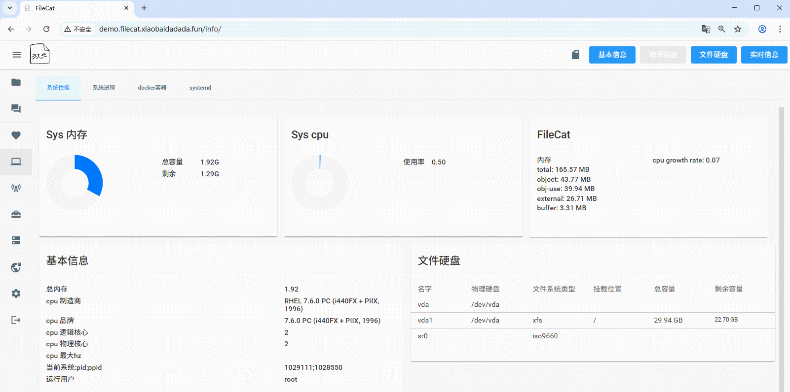
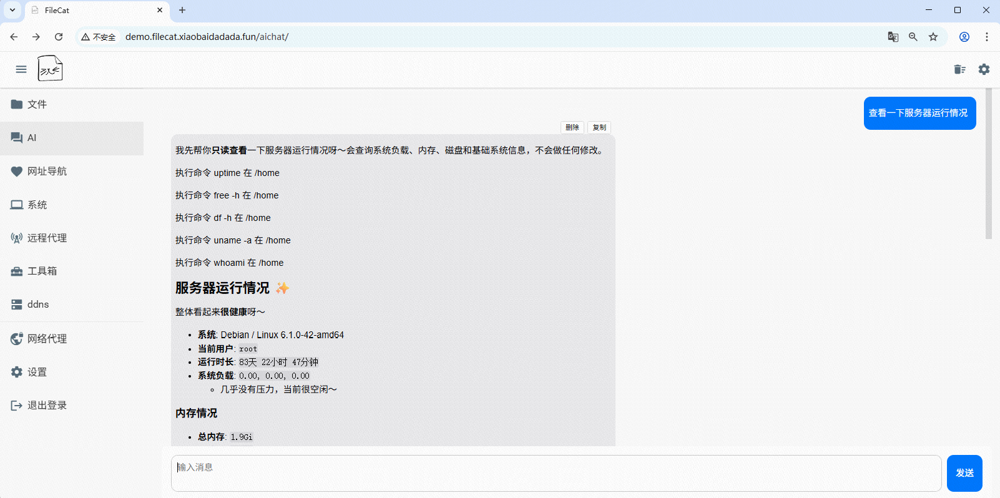

#  FileCat

  
  
  
  
  
  

[中文文档](./README.md)

FileCat is a web-based file server and a lightweight server management tool. After deployment, you can browse files on the server through a browser, with support for online preview of multiple file formats (images, videos, drawings, Markdown, etc).

On top of file management, FileCat integrates various server operation and management features, allowing you to manage and operate server files more conveniently.

## Screenshots

### File List

### Intranet Penetration

### System Dashboard

### AI Features

In addition to the above, FileCat also supports features such as instant opening of large text log files, Windows remote desktop, simple image editing, CI/CD workflows, Excalidraw drawing, etc.

## Demo

http://demo.filecat.xiaobaidadada.fun/

username/password: demo/demo  
Chinese account: demo-zh/demo

Demo server provided by [野草云](https://my.yecaoyun.com/aff.php?aff=7185)

## Installation

Minor bug fixes and feature updates are published on npm in real time.

### 1. Npm
